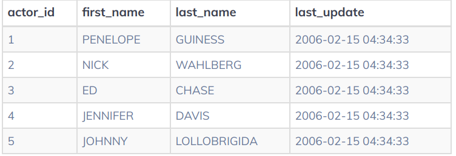

# PostgreSQL

# Giới thiệu về cơ sở dữ liệu
SQL (structured query language) là ngôn ngữ dùng để giao tiếp với hệ quản trị cơ sở dữ liệu.

**Cơ sở dữ liệu:** tập hợp các dữ liệu có tổ chức. Ví dụ cơ sở dữ liệu của một cơ quan là tập hợp các dữ liệu: hồ sơ nhân viên, lịch sử ra vào...

**Cơ sở dữ liệu quan hệ:** dữ liệu được tổ chức dưới dạng bảng. Một bảng chứa các hàng và cột dữ liệu. Bảng có một khóa (key) duy nhất để xác định từng hàng của bảng.

SQL được sử dụng để tương tác với cơ sở dữ liệu quan hệ. Ta thường xem cơ sở dữ liệu quan hệ là cơ sở dữ liệu SQL.

SQL được sử dụng để thực hiện các hoạt động C.R.U.D (tạo, truy xuất, cập nhật và xóa) trên cơ sở dữ liệu quan hệ.

SQL cũng có thể thực hiện các tác vụ quản trị trên cơ sở dữ liệu như bảo mật , sao lưu, quản lý người dùng...

Ta có thể tạo cơ sở dữ liệu và bẳng bên trong một cơ sở dữ liệu bằng SQL.

## Bảng (table)
Một CSDL thường chứa một hoặc nhiều bảng. Một bảng có thể được xem như là một quan hệ (relation).

Bảng dùng để lưu thông tin của một đối tượng trong thực tế, mỗi bảng được xác định bằng một tên ví dụ `film` hay `actor`. Một bảng có các bản ghi (dòng) và các trường (cột).
* **Bản ghi (record):** chứa dữ liệu cụ thể như thông tin về một nhân viên, một sản phẩm cụ thể
* **Trường:** chứa dữ liệu về một khía cạnh nào đó của đối tượng như tên, tuổi, địa chỉ email...

Ví dụ bảng trên có 5 bản ghi (mỗi bản ghi là thông tin của một diễn viên), có 4 trường.

## SQL commnet
* **Comment trên 1 dòng:** Comment trên một dòng bắt đầu bằng cú pháp `--`. Bất kỳ văn bản nào nằm giữa dấu `--` đến cuối dòng sẽ không được thực thi.
```SQL
--Chọn tất cả:
SELECT * FROM Customers;
```
* **Comment nhiều dòng:** Khi bạn cần comment trên một đoạn văn dài, bạn chỉ cần thêm cú pháp `/*` vào đầu văn bản và kết thúc đoạn bằng cú pháp `*/`. Bất cứ văn bản nào nằm giữa hai kí hiệu `/*` và `*/` sẽ không được thực thi.
```SQL
/*Chọn tất cả các cột
của tất cả các bản ghi
trong bảng Customers:*/
SELECT * FROM Customers;
```

## PostgreSQL data types
Một số loại dữ liệu khác nhau có trong PostgeSQL:
* **Text:** được dùng cho các giá trị chuỗi như tên
* **Numeric:** được dùng cho các giá trị số
* **Temporal:** dùng cho các giá trị dữ liệu dại diện cho **ngày và thời gian**
* **Boolean:** dùng cho các giá trị dữ liệu có một trong 2 trạng thái là **True và False**
Ngoài ra còn có một số kiểu dữ liệu khác, tạm thời tìm hiểu vậy đã.

### Kiểu dữ liệu văn bản
Các kiểu dữ liệu văn bản có sẵn trong PostgreSQl bao gồm:
* `TEXT`
    * Kiểu `TEXT` dùng cho chuỗi kí tự **không giới hạn về chiều dài**
    * Kiểu `TEXT` là lựa chọn tốt cho dữ liệu văn bản có độ dài không xác định
* `VARCHAR`
    * Kiểu `VARCHAR` lưu chuỗi kí tự không bị giới hạn về chiều dài. Ngoài nó kiểu `VARCHAR` còn cho phép người dùng đặt giới hạn đối với các giá trị dữ liệu được gọi thông qua số nguyên **N** được đặt trong () ngay sau `VARCHAR`. Ví dụ `VARCHAR(50), VARCHAR(100)`.
    * Kiểu `VARCHAR` cho phép chuỗi có ít hơn **N** kí tự được lưu trong cột. Cố gắng chèn chuỗi có độ dài lớn hơn **N** sẽ dẫn đến lỗi.
    * Việc khai báo cột có kiểu dữ liệu `VARCHAR` mà không chỉ định **N** tương đương với khai báo một cột có kiểu dữ liệu `TEXT`.
* `CHAR`
    * Một cột chỉ khai báo `CHAR` sẽ lưu được duy nhất 1 kí tự
    * Một cột được khai báo `CHAR(N)` nó lưu trữ được N kí tự. Khác với `VARCHAR(N)`, nếu chuỗi không đủ **N** kí tự nó sẽ tự thêm khoảng trắng vào bên phải để đủ **N** kí tự.

### Kiểu dữ liệu số
PostgreSQL cung cấp 2 kiểu dữ liệu số: số nguyên, số thực dấu phấy động.

**Số nguyên**
Có 3 kiểu số nguyên trong PostgreSQL:
* `SMALLINT`- số nguyên có dấu được lưu trữ bằng 2 byte (16 bits, 1 bit để làm bit dấu), có phạm vi từ **-32768 đến 32767**
* `INTEGER` - kiểu số nguyên có dấu, được lưu trữ bằng 4 bytes (32 bits, 1 bit dấu), có phạm vi từ **-2.147.483.648 đến 2.147.483.647**
* `SERIAL` - kiểu số nguyên, PostgreSQL sẽ tự động tạo và điền các giá trị tăng dẫn vào cột `SERIAL` (giống kiểu tăng số thứ tự, ID). Điều này tương tự với cột `AUTO_INCREMENT` trong cột MySQL hoặc `AUTO INCREMENT` trong SQLite.

**Số thực dấu phẩy động**
Có 3 kiểu số thực dấu phẩy động chính:
* `FLOAT(n)` - số thực dấu phẩy động có độ chính xác ít nhất là **n**, được lưu trữ tối đa bằng 8 bytes.
* `REAL` hoặc `FLOAT8` - được lưu trữ bằng 4 bytes
* `NUMERIC` hay `NUMERIC (p,s)` - số thực có p chữ số với số `s` sau dấu thập phân. Trong PostgeSQL `NUMERIC` và `DECIMAL` tương đương nhau và có thể thay thế cho nhau.

### Kiểu dữ liệu Boolean
Một kiểu dữ liệu `BOOLEAN` có một trong 3 trạng thái true, false hoặc null. Có thể dùng từ khóa `BOOLEAN` hoặc `BOOL` để khai báo một cột với kiểu dữ liệu `BOOLEAN`.


Một cột `BOOLEAN` có mặc định `false` rất ít. Đa số giá trị mặc định sẽ là `true. Ví dụ hệ thống quản lý người dùng có cột hành vi mặc định là người dùng có thể đăng ký truy cập web.

### Kiểu dữ liệu Temporal (tạm thời)
Kiểu dữ liệu tạm thời cho phép lưu trữ ngày tháng hoặc thời gian. PostgreSQL có 5 kiểu dữ liệu tạm thời chính:
* `DATE` - lưu giá trị ngày tháng năm
* `TIME` - lưu giá trị thời gian trong ngày
* `TIMESTAMP` - lưu cả ngày tháng năm và thời gian trong ngày
* `TIMESTAMPTZ` - kiểu dữ liệu dấu thời gian, nhận biết múi giờ (viết tắt của dấu thời gian và múi giờ)
* `INTERVAL` - lưu khoảng thời gian
* `TIMESTAMPTZ` - phần mở rộng của PostgreSQL trên các kiểu dữ liệu tạm thời theo chuẩn SQL.


