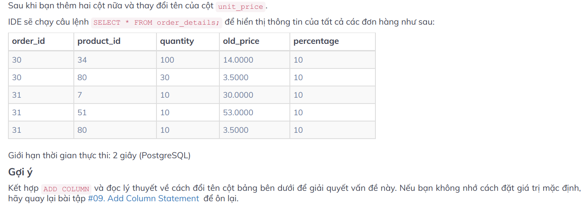

# Khởi tạo bảng trong PostgreSQL
Để tạo bảng mới trong PostgreSQL sử dụng câu lệnh `CREATE TABLE`. Cú pháp đầy đủ như sau:
```SQL
CREATE TABLE tên_bảng (
    tên_cột kiểu_dữ_liệu ràng_buộc,
    tên)cột kiểu_dữ_liệu ràng_buộc
)
```
Như cú pháp ở trên chúng ta có thể tạo nhiều cột, các cột ngăn cách nhau bằng dấu phẩy `,`. Các ràng buộc có thể có hoặc không.
Ví dụ chúng ta sẽ tạo một bảng có tên là `account` có các cột sau với các kiểu dữ liệu tương ứng.
* user_id - `SERIAL`
* username - `VARCHAR(50)`
* password - `VARCHAR(50)`
* email - `VARCHAR(355)`
* created_on - `DATE` mặc định là ngày hiện tại
* last_login - `TIMESTAMP`

Câu lệnh để tạo bảng như sau:
```SQL
CREATE TABLE account(
    user_id SERIAL,
    username VARCHAR(50),
    password VARCHAR(50),
    email VARCHAR(355),
    created_on DATE DEFAULT CURRENT_DATE,
    last_login TIMESTAMP
);
```

# Insert Statement
## Thêm 1 hàng
Khi muốn chèn một hàng vào bảng chúng ta có thể thực hiện theo cú pháp sau
```SQL
INSERT INTO bảng(cột_1, cột_2,...) VALUES (giá_trị_1, giá_trị_2);
```
* Chỉ định tên bảng muốn chèn hàng sau `INSERT INTO`, theo sau là các cột được cách nhau bằng dấy phẩy `,`.
* Liệt kê danh sách các giá trị được cách nhau abwngf dấu phẩy `,` sau `VALUES`. Danh sách giá trị cần khớp với danh sách tên cột chỉ định.

Ví dụ chèn hàng trong PostgreSQL. Chúng ta cần chèn các hàng mới vào bảng `link` có 5 cột `id, url, name, description, rel`.
```SQL
INSERT INTO link (id, url, name, description, rel) VALUES ('1', 'http://alo.com', 'alo', NULL, NULL);

INSERT INTO link (id, url, name, description, rel) VALUES ('2', 'http://baoi.com', 'bao');

INSERT INTO link (id, url, name, description, rel) VALUES ('3', 'http://em.com', 'em', NULL, NULL);
```
**Chú ý:** 
* Chèn kí tự phải để trong dấu nháy đơn `''`, đối với kiểu dữ liệu số thì không cần.
* Nếu bỏ quan bất kì cột nào chấp nhận `NULL` cột sẽ lấy giá trị mặc định của nó. Trong trường hợp giá trị mặc định không được đặt cho cột, cột sẽ lấy giá trị `NULL`.

Để kiểm tra hàng đã được chèn vào bảng hay chưa có thể kiểm tra theo cách sau:
```SQL
SELECT * FROM link;     -- hiển thị tất cả các bản ghi của bảng link
```
Đầu ra nhận được


## Thêm nhiều hàng
Ngoài cách thêm từng hàng vào bảng, chúng ta có thêm nhiều hàng vào bảng cùng một lúc như sau:
```SQL
INSERT INTO bảng (cột_1, cột_2)
VALUES 
        (giá_trị_1, giá_trị_2, ...),
        (giá_trị_1, giá_trị_2, ...);
```
Đơn giản chúng ta chỉ cần thêm danh sách giá trị được phân tách bằng dấu phẩy `,`, mỗi giá trị cũng cách nhau bằng dấu phẩy `,`.

## Chèn dữ liệu từ một bảng sang bảng khác
Để chèn dữ liệu từ một bảng đến bảng khác ta sử dụng câu lệnh `INSERT INTO SELECT` như sau:
```SQL
INSERT INTO bảng(cột_1, cột_2, ...)
SELECT cột_1, cột_2, ...
FROM bảng_khác WHERE điều_kiện;
```
Ở đây cần chỉ định những cột của bảng muốn truy vấn dữ liệu trong mệnh đề `SELECT`. Tiếp theo cần chỉ định tên của bảng muốn truy vấn sau từ khóa `FROM`. Mệnh đề `WHERE` được sử dụng để lọc các hàng.
Câu lệnh `INSERT INTO` sẽ chèn tất cả dữ liệu mà bạn đã lấy được từ bảng khác.
Nếu muốn chỉ chèn giá trị duy nhất từ một bảng khác (ví dụ nhiều hàng trùng nhau, chúng ta sẽ lấy duy nhất một hàng thôi), bạn có thể sử dụng từ khóa `DISTINCT` trong câu lệnh `SELECT`:
```SQL
INSERT INTO bảng(cột_1, cột_2, ...)
SELECT DISTINCT cột_1, cột_2, ...
FROM bảng_khác WHERE điều_kiện;
```
Ví dụ về việc lấy thông tin professors của một cơ sở dữ liệu để đưa sang bảng khác
```SQL
-- Insert unique professors into the new table
INSERT INTO professors(first_name, last_name, university_shortname)
SELECT DISTINCT
first_name, last_name, university_shortname
FROM
university_professors;

-- Doublecheck the contents of professors
SELECT * FROM professors;
```
Ở đây do có một số hàng trùng nhau nên chỉ lấy duy nhất 1 lần thôi.

## Thực hành
Trong PostgreSQL dãy số là một loại đối tượng đặc biệt tạo ta một chuỗi các số nguyên. Dãy số thường được sử dụng làm cột khóa chính (`key`) trong bảng (ví dụ như số thứ tự, ID).
Khi khởi tạo bản dãy số có thể được tạo thông qua kiểu dữ liệu `SERIAL` như sau:
```SQL
CREATE TABLE table_name(
    id SERIAL
);
```
Bằng cách gán `SERIAL` cho cột id, PostgeSQL thực hiện như sau:
* Đầu tiên nó tạo một đối tượng dãy số và đặt giá trị tiếp theo được tạo bởi dãy số làm giá trị mặc định cho cột
* Thêm một ràng buộc `NOT NULL` vào cột `id` vì một dãy số luôn tạo ra một số nguyên, đó là một giá trị không null
* Nếu gán đối tượng sở hữu chuỗi cho cột `id`, kết quả là đối tượng dãy số sẽ bị xóa khi cột `id` hoặc bảng bị hủy.

Ví dụ sau tạo bảng **fruits** với cột **id**:
```SQL
CREATE TABLE fruits(
    id SERIAL PRIMARY KEY,
    name VARCHAR NOT NULL
);
```
Tham khảo ví dụ sau
```SQL
INSERT INTO fruits(name) VALUES ('Orange');
INSERT INTO fruits(id, name) VALUES (DEFAULT, 'Apple');
```
Sau đó kiểm tra bảng
```SQL
SELECT * FROM fruits;
```


Ví dụ tiếp theo chúng ta sẽ thiết kết bảng `employees` như sau:

Sau khi thực hiện một số câu lệnh như bên dưới

Kết quả nhận được như sau:


Chú ý bảng sẽ chỉ hiển thị các lênh `INSERT` hợp lệ. Câu lệnh INSERT cuối cùng tên dài hơn 10 kí tự nên không hợp lệ. Câu lệnh INSERT thứ 5 và 6 không hợp lệ do **emp_id** có kiểu dữ liệu là `SERIAL` mà lại đi chèn vào dữ liệu dạng text.

## Thêm cột mới
Để thêm cột mới vào bảng hiện có, có thể sử dụng câu lệnh `ALTER TABLE ADD COLUMN` như sau:
```SQL
ALTER TABLE tên_bảng ADD COLUMN tên_cột_mới kiểu_dữ_liệu DEFAULT giá_trị;
```
* Đầu tiên, chỉ định tên bảng muốn thêm cột mới trong mệnh đề `ALTER TABLE`
* Thứ hai chỉ ra tên cột với thuộc tính của nó như kiểu dữ liệu, giá trị mặc định... trong mệnh đề `ADD COLUMN`
* Nếu cột muốn thêm có giá trị mặc định thì thêm giá trị đó sau mệnh đề `DEFAULT`.

Để thêm nhiều cột vào bảng, có thể sử dụng nhiều mệnh đề `ADD COLUMN` trong câu lệnh `ALTER TABLE` như sau:

```SQL
ALTER TABLE tên_bảng
ADD COLUMN tên_cột_mới_1 kiểu_dữ_liệu ràng_buộc DEFAULT giá_trị,
ADD COLUMN tên_cột_mới_2 kiểu_dữ_liệu ràng_buộc DEFAULT giá_trị,
...;
```
Cùng xem ví dụ về lệnh `ADD COLUMN` trong PostgreSQL.
Tạo một bảng mới có tên là **customers** với hai cột là **id** và **customer_name**:

```SQL
CREATE TABLE customers (
    id SERIAL PRIMARY KEY
    customer_name VARCHAR NOT NULL
);
```

Sau khi thực hiện câu lệnh sau:
```SQL
ALTER TABLE customers ADD COLUMN phone VARCHAR;
ALTER TABLE customers ADD COLUMN fax VARCHAR, ADD COLUMN email VARCHAR;
```

Như vậy chúng ta sẽ có bảng với cấu trúc của các cột như sau:


```SQL
/* Implement the missing code, denoted by ellipses. You may not modify the pre-existing code. */

--Column description should be set to "TBD" (for To Be Defined).
ALTER TABLE restaurants ADD COLUMN description TEXT DEFAULT 'TBD';
--Column active should be set to 1.
ALTER TABLE restaurants ADD COLUMN active SMALLINT DEFAULT 1;

-- Show the information of all restaurants ordering by id.
SELECT * FROM restaurants ORDER BY id; 
```


## Change column data type - Thay đổi kiểu dữ liệu trong cột
Để thay đổi kiểu dữ liệu của một cột có thể sử dụng câu lệnh `ALTER TABLE` như sau:
```SQL
ALTER TABLE tên_bảng ALTER COLUMN tên_cột [SET DATA] TYPE kiểu_dữ_liệu_mới;
```
* Đầu tiên chỉ định tên bảng chứa cột muốn thay đổi ở mệnh đệ `ALTER TABLE`
* Thứ hai, đặt tên của cột muốn thay dổi sau mệnh đề `ALTER COLUMN`
* Thứ ba, cung cấp kiểu dữ liệu mới cho cột sau từ khóa `TYPE`. Có thể sử dụng `SET DATA TYPE` hay `TYPE` đều được.

Để thay đổi kiểu dữ liệu của nhiều cột trong một câu lệnh hãy sử dụng cú pháp sau:
```SQL
ALTER TABLE tên_bảng
ALTER COLUMN tên_cột_1 [SET DATA] TYPE kiểu_dữ_liệu_mới,
ALTER COLUMN tên_cột_2 [SET DATA] TYPE kiểu_dữ_liệu_mới,
...;
```
Ví dụ về việc thay đổi kiểu dữ liệu của cột trong PostgreSQL.
Tạo bảng có tên là `assets`:
```SQL
CREATE TABLE assets (
    id SERIAL PRIMARY KEY,
    name TEXT NOT NULL,
    asset_no VARCHAR NOT NULL,
    description TEXT,
    location TEXT,
    acquired_date DATE NOT NULL
);
```
Các câu lệnh sau đây thay đổi kiểu dữ liệu của cột **location** và cột **description** từ `TEXT` sang `VARCHAR`:
```SQL
ALTER TABLE assests
ALTER COLUMN location TYPE VARCHAR,
ALTER COLUMN description TYPE VARCHAR;
```


```SQL
/* Implement the missing code, denoted by ellipses. You may not modify the pre-existing code. */

ALTER TABLE employees ALTER COLUMN emp_id TYPE VARCHAR(7);

--Insert information of employees to database
INSERT INTO employees(emp_id,emp_name,hire_date,salary,com) 
VALUES 
('SE00001','Marie','2017-01-01',2000,0.03),
('SE00002','Harry','2017-01-01',2000.55,0.03),
('SE00003','Maries','2017-01-01',3000,0.03),
('SE00004','Ron','2017-01-01',3000,0.03),
('003','Hermione','2017-01-01',3000,0.03);

--Show all the information of all employees ascendingly
SELECT * FROM employees ORDER BY emp_id;
```

## Rename column statement - Thay đổi tên cột
Để đổi tên cột của bảng ta sử dụng câu lệnh `ALTER TABLE` với mệnh đệ `RENAME COLUMN` như sau:
```SQL
ALTER TABLE tên_bảng RENAME COLUMN tên_cột TO tên_cột_mới;
```
* Đầu tiên chỉ định bảng chứa cột muốn đổi tên sau mệnh đề `ALTER TABLE`
* Thứ hai, xác định tên cột sau mệnh đồ `RENAME COLUMN`
* Thứ ba, đặt tên mới cho cột sau từ khóa `TO`

Từ khóa `COLUMN` trong câu lệnh trên là tùy chọn, do đó hoàn toàn có thể bỏ qua nó như trong câu lệnh sau
```SQL
ALTER TABLE tên_bảng RENAME tên_cột TO tên_cột_mới;
```
Ví dụ về việc thay đổi tên cột trong PostgreSQL. Đầu tiên tạo bảng mới **customers**.
```SQL
CREATE TABLE customers (
    id SERIAL PRIMARY KEY,
    name VARCHAR NOT NULL,
    phone VARCHAR NOT NULL,
    email VARCHAR
);
```

Sau đó chúng ta sẽ thay tên cột **name** và **phone** thành **customer_name**, **contact_phone** như sau:
```SQL
ALTER TABLE customers RENAME COLUMN name TO customer_name;

ALTER TABLE customers RENAME phone TO contact_phone
```




Dưới đây là đáp án:
```SQL
/* Implement the missing code, denoted by ellipses. 
You may not modify the pre-existing code. */

--rename column unit_price to old_price
ALTER TABLE order_details RENAME COLUMN unit_price TO old_price;
--add column percentage, default value is 10
ALTER TABLE order_details ADD COLUMN percentage SMALLINT DEFAULT 10;

--Show the inforomation of all order details
SELECT * FROM order_details;e
```
