# Update dữ liệu

## Thay đổi giá trị trong cột (có chọn lọc)
Để thay đổi giá trị của các cột trong bảng, chúng ta có thể sử dụng câu lệnh `UPDATE`. Sau đây là ví dụ minh họa:
```SQL
UPDATE bảng
SET cột_1 = giá_trị_1, cột_2 = giá_trị_2, ...
WHERE điều_kiện;
```

* Đầu tiên chỉ định tên bảng nơi muốn update dữ liệu sau mệnh đề `UPDATE`
* Thứ hai liệt kê các cột có giá trị muốn thay đổi trong mệnh đề `SET`. Nếu cập nhật giá trị trong nhiều cột thì sử dụng dấu phẩy `,` để phân tách từng cặp cột và giá trị. Các cột không có trong danh sách giữ lại các giá trị ban đầu của chúng
* Thứ ba xác định hàng nào muốn cập nhật trong điều kiện của mệnh đề `WHERE`.

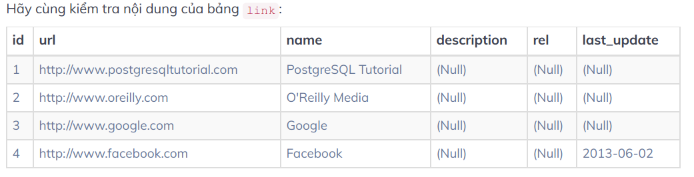
Để thay đổi giá trị `NULL` của cột `last_update` thành `2019-06-02` ta sử dụng câu lệnh:
```SQL
UPDATE links
SET last_update = '2019-06-02'
WHERE last_update IS NULL;

-- show information of all links
SELECT * FROM link
```
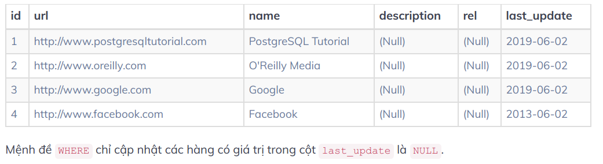

Xem thêm một ví dụ thực tế.
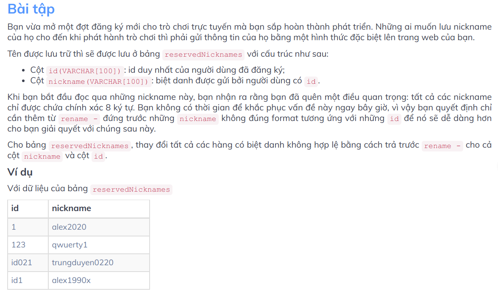
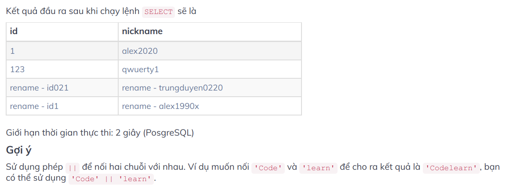

Đây là đáp án cho bài tập vừa rồi:
```SQL
/* Implement the missing code, denoted by ellipses. 
You may not modify the pre-existing code. */

UPDATE reservedNicknames
SET id = 'rename - ' || id, nickname = 'rename - ' || nickname
 --update only with nickname which has the length different from 8 characters.
WHERE LENGTH(nickname) <> 8;

--Show the information of all reserved nicknames ordering by id.
SELECT * FROM reservedNicknames ORDER BY id;
```

## Thay đổi giá trị trong cột (toàn bộ)
Để thay đổi toàn bộ giá trị trong cột bằng một giá trị khác ta cũng thực hiện giống như trên, chỉ khác là không có mệnh đề `WHERE`.
Ví dụ có một bảng `link` như sau:
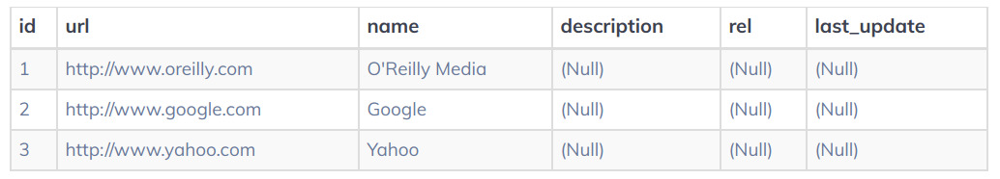
Để cập nhật các giá trị của cột `rel` thành `nofollow` cho tất cả các hàng trong bảng, se bỏ qua `WHERE` trong câu lệnh `UPDATE` như sau:
```SQL
UPDATE link
SET rel = 'nofollow'
```
Kết quả ta nhận được bảng sau:
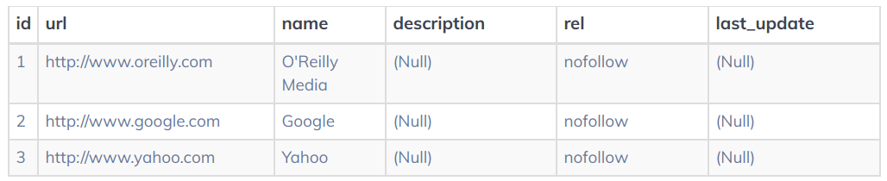

## Cập nhật cột dựa trên giá trị từ bảng khác
```SQL
UPDATE bảng_a
SET cột_cần_update = bảng_b.cột_cập_nhật_theo
FROM bảng_b
WHERE điều_kiện_1 AND điều_kiện_2 OR ...;
```
* Đối với mỗi hàng trong `bảng_a`, tìm hàng tương ứng trong `bảng_b` thỏa mãn điều kiện bên dưới
* Đặt giá trị `của cột_cập_nhật` thành giá trị của `cột_cập_nhật_theo`

Các điều kiện thường so sánh các cột khác của cả hai bảng, ví dụ `bảng_a.cột_a = bảng_b.cột_b`. Tất nhiên truy vẫn này chỉ có ý nghĩa nếu chỉ có một hàng khớp trong `bảng_b`.

**Bài tập**
Vào một ngày làm việc bình thường, bạn thấy rằng cột `professor_id` của bảng `affiliations` mang giá trị `null`. Khi bạn đưa vấn đề này đến cuộc họp với khách hàng, khách hàng đã cung cấp thông tin của bảng `professors` bao gồm các cột `id`, `first_name`, `last_name` và `university_shortname`. Họ yêu cầu bạn cập nhật cột `professor_id` của bảng `affiliations` dựa theo bảng `professors`. Cấu trúc của hai bảng được mô tả dưới đây:
* Bảng `affiliations`
    * Cột `first_name(VARCHAR[60])`: tên của giáo sư.
    * Cột `last_name(VARCHAR([60])`: họ của giáo sư.
    * Cột `function(TEXT)`: vị trí làm việc hiện tại của giáo sư
    * Cột `organization_id(TEXT)`: id của tổ chức mà giáo sư đã tham gia
    * Cột `professor_id(SMALLINT)`: id của giáo sư.
* Bảng professors 
    * Cột `id(SMALLINT)`: id của giáo sư là khóa chính.
    * Cột `first_name(VARCHAR([60])`: tên của giáo sư.
    * Cột `last_name(VARCHAR([60])`: họ của giáo sư.
    * Cột `university_shortname(CHAR[3])`: viết tắt của tên trường.
Trong bảng `affiliations`, hãy đặt giá trị cho cột `professor_id` tương đương với cột `id` trong bảng `professors` với điều kiện là `first_name` và `last_name` tương ứng với các hàng trong bảng `professors`.
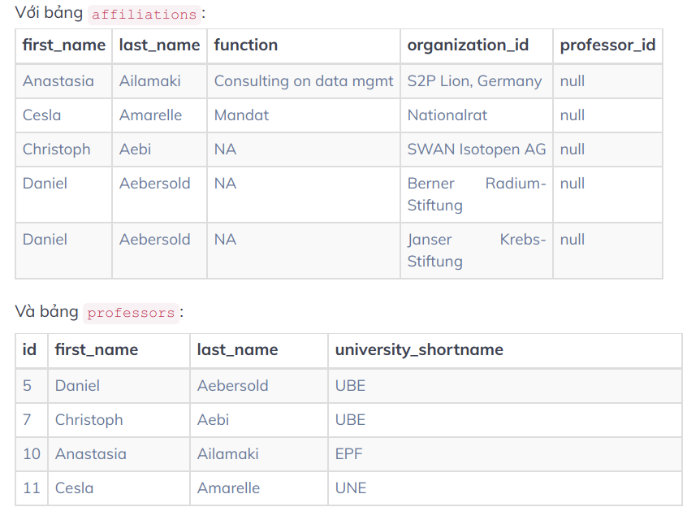

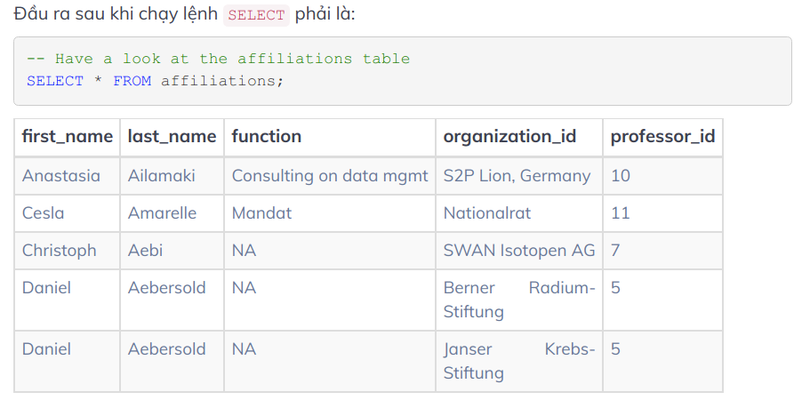
Đáp án:
```SQL
-- Set professor_id to professors.id where first_name, last_name correspond to rows in professors
UPDATE affiliations
SET 
professor_id = professors.id
FROM 
professors
WHERE 
affiliations.first_name = professors.first_name AND affiliations.last_name = professors.last_name;

-- Have a look at the affiliations table
SELECT * FROM affiliations;
```

## Xóa cột
Để xóa cột trong bảng có teher sử dụng mệnh đề `DROP COLUMN` trong câu lệnh `ALTER TABLE` như sau:
```SQL
ALTER TABLE tên_bảng DROP COLUMN tên_cột;
```
Khi xóa một cột PostgreSQL sẽ tự động xóa tất cả các indexes và các ràng buộc liên quan đến cột.
Nếu xóa một cột đang được sử dụng trong các đối tượng CSDL như views, triggers, stores procedures... diều này sẽ không thực hiện hiện được vì các đối tượng khác đang phụ thuộc vào nó. Trường hợp này hãy thêm tùy chọn `CASCADE` vào mệnh đề `DROP COLUMN` để xóa cột và tất cả các đối tượng liên quan đến nó.
```SQL
ALTER TABLE tên_bảng DROP COLUMN tên_cột CASCADE;
```
Nếu xóa cột không tồn tại PostgreSQL sẽ báo lỗi. Để tránh điều này có thể thêm tùy chọn `IF EXITS` như sau:
```SQL
ALTER TABLE tên_ảng DROP COLUMN IF EXISTS tên_cột;
```
Nếu làm như vậy PostgreSQL sẽ thông báo thay vì đưa ra lỗi.
Nếu muốn xóa nhiều cột của bảng trong một lệnh có thể thực hiện như sau:
```SQL
ALTER TABLE tên_bảng
DROP COLUMN tên_cột_1,
DROP COLUMN tên_cột_2,
...;
```
PostgeSQL cho phép xóa cột duy nhất của bảng, làm bảng không có cột nào. Đây là điều không được phép trong tiêu chuẩn SQL.

Bạn đang quản lý một dịch vụ giới thiệu nhà hàng gần đây đã bắt đầu trở nên phổ biến.
Thông tin về các nhà hàng hiện được lưu trữ trong bảng restaurants với cấu trúc bảng như sau:

* Cột `id(SMALLINT)`: id của nhà hàng
* Cột `name(VARCHAR[50])`: m tên của nhà hàng
* Cột `description(VARCHAR[50])`: thông tin giới thiệu của nhà hàng
* Cột `active(SMALLINT)`: trạng thái của nhà hàng (hoạt động/ không hoạt động)

Bạn thấy rằng cột `description` và cột `active` hơi mơ hồ nên bạn muốn xóa bỏ hai cột này. Với dữ liệu của bảng `restaurants`, bạn hãy dùng câu lệnh `DROP COLUMN` để xóa bỏ hai cột `description` và cột `active` nhé.
```SQL
/*Implement the missing code, denoted by ellipses. 
You may not modify the pre-existing code.*/

ALTER TABLE restaurants 
DROP COLUMN description,
DROP COLUMN active;

--Show the information of all restaurants ordering by id.
SELECT * FROM restaurants ORDER BY id;
```

## Xóa bảng (DROP TABLE)
Để xóa bảng khỏi CSDL có thể sử dụng câu lệnh `DROP TABLE` như sau:
```SQL
DROP TABLE [IF EXISTS] tên_bảng [CASCADE | RESRTRICT];
```
* Cần chỉ định tên bảng sau từ khóa `DROP TABLE` để xóa bảng vĩnh viễn khỏi CSDL. Nếu xóa bảng không tồn tại PostgreSQL sẽ báo lỗi do đó cần thêm tham số `IF EXISTS` theo sau câu lệnh `DROP TABLE`.
* Trường hợp bảng muốn xóa được sử dụng trong các views, constraints hoặc bất kỳ đối tượng nào `CASCADE` cho phép tự động xóa tất cả các đối tượng phụ thuộc cùng với bảng.
* `RESTRICT` từ chối việc xóa bảng nếu có bất kỳ đối tượng phụ thuộc nào. PostgreSQL sử dụng `RESTRICT` theo mặc định.

Ví dụ loại bỏ bảng `author`:
```SQL
DROP TABLE author;
```
Nếu bảng `author` không tồn tại sẽ báo lỗi
```SQL
ERROR: table "author" does not exist
```
Để tránh báo lỗi cần thêm tham số `IF EXISTS`:
```SQL
DROP TABLE IF EXISTS author;
```

## Xóa hàng khỏi bảng
Để xóa dữ liệu khỏi bảng ta sử dụng câu lệnh `DELETE` như sau:
```SQL
DELETE FROM tên_bảng WHERE điều_kiện;
```
* Đầu tiên chỉ định bảng muốn xóa dũ liệu sau mệnh đề `DELETE FROM`
* Thứ hai chỉ định hàng cần xóa bằng cách sử dụng điều kiện trong mệnh đề `WHERE`. Mệnh đề `WHERE` là tùy chọn, nếu bỏ qua `WHERE` nó sẽ xóa tất cả các hàng trong bảng.

Ví dụ chúng ta có bảng `link` như sau:
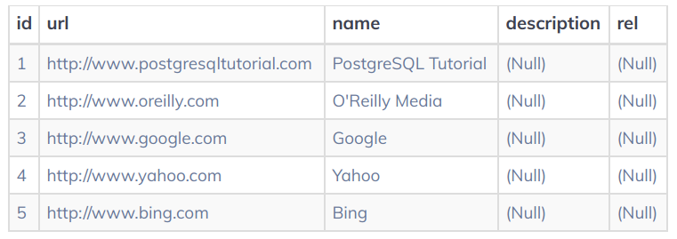
Câu lệnh sau sẽ xóa các hàng có giá trị trong cột `id` khác với 1 và 5:
```SQL
DELETE FROM link WHERE id NOT IN (1, 5);
```
Bảng cuối cùng nhận được như này:
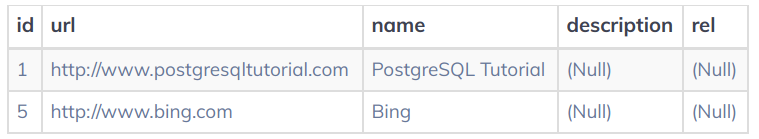

Thêm ví dụ nữa
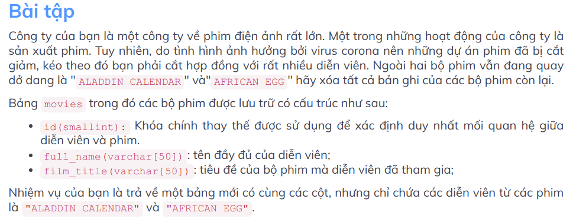
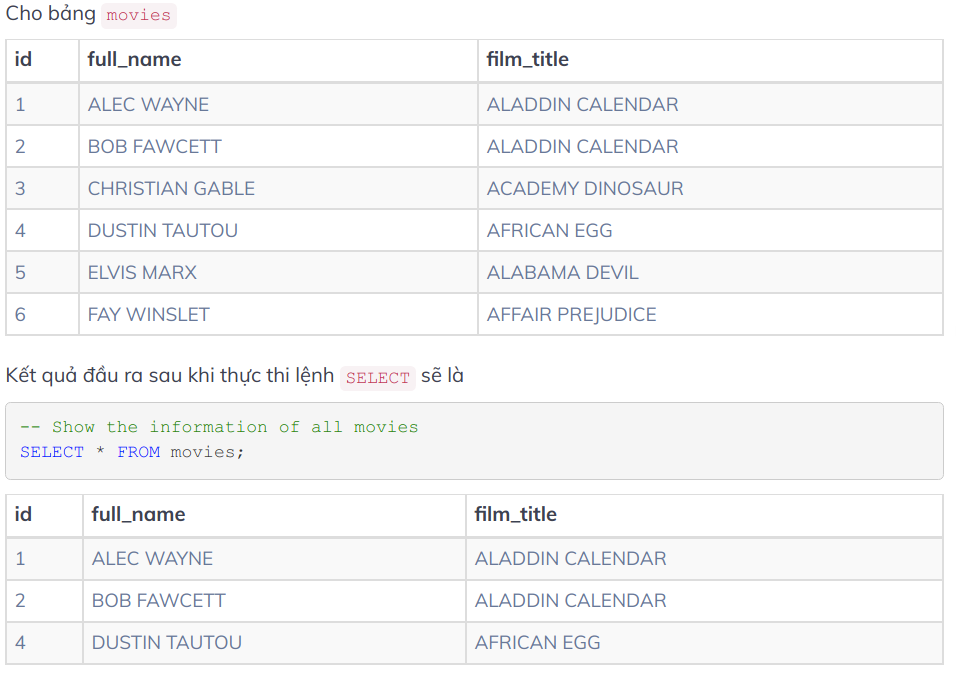

```SQL
--Delete records from the `movies` table that are neither "ALADDIN CALENDAR" nor "AFRICAN EGG".
DELETE FROM 
movies
WHERE
film_title NOT IN ('ALADDIN CALENDAR', 'AFRICAN EGG');

-- Show the information of all movies
SELECT * FROM movies;
```

## Truncate bảng (cắt bảng)
`TRUNCATE` nhanh chóng xóa tất cả các hàng khỏi một tập hợp các bảng. Câu lệnh này có tác dụng tương tự như câu lênh `DELETE` trên mỗi bảng nhưng vì nó không thực sự quét qua các bảng nên nó nhanh hơn. Hơn nữa `TRUNCATE` giải phóng không gian ổ đĩa ngay lập tức, điều này rất hữu ích trên các bảng lớn.

Hình thức đơn giản nhất của câu lệnh `TRUNCATE TABLE` như sau:
```SQL
TRUNCATE TABLE tên_bảng;
```
**Xóa tất cả dữ liệu khỏi nhiều bảng**
Để xóa tất cả dữ liệu khỏi nhiều ảng cùng lúc ta tách từng bẳng bằng dấu phẩy `,` như sau:
```SQL
TRUNCATE TABLE tên_bảng_1, tên_bảng_2, ...;
```

**Xóa tất cả dữ liệu khỏi bảng có tham chiếu khóa ngoại**
Trong thực tế bảng muốn xóa đi thường có các tham chiếu khóa ngoại từ các bảng khác không được liệt kê trong câu lệnh `TRUNCATE TABLE`. Theo mặc định câu lệnh `TRUNCATE TABLE` không xóa bất kỳ dữ liệu nào khỏi bảng có tham chiếu khóa ngoại.

Để xóa dữ liệu khỏi bảng chính và tất cả bảng có tham chiếu khóa ngoại đến bảng chính, có thể dùng tùy chọn `CASCADE` như sau:
```SQL
TRUNCATE TABLE tên_bảng CASCADE;
```
Nên cẩn thận khi dùng `CASCADE` vì có thể xóa bảng mà không có ý định xóa.
