# Chuẩn hóa dữ liệu

## Mở đầu
Chuẩn hóa dữ liệu (data normalization) được thực hiện để đảm bảo dữ liệu khỏi sự bất thường và giữ nguyên tính toàn vẹn của dữ liệu.

Nếu dữ liệu không được chuẩn hóa đúng cách và sự tồn tại của dữ liệu thừa không những làm tăng bộ nhớ mà còn cản trở quá trình thao tác.


Nhận thấy dữ liệu có các trường (cột) ` branch, hod` và `office_tel` lặp lại đối với các sinh viên học cùng một chi nhánh trong đại học. Đây chính là dư thừa dữ liệu (**Data Redundancy**).

Nếu phải chèn dữ liệu của 100 sinh viên cùng ngành thì thông tin chi nhánh sẽ được lặp lại cho tất cả 100 sinh viên. Đó chính là chèn dị thường (**Insertion anomalies**).

Nếu bạn X rời đại học hoặc không còn là HOD của khoa khoa học máy tính. Trong trường hợp đó tất cả các hồ sơ sinh viên sẽ được cập nhật, nếu nhầm lẫn ta sẽ bỏ lỡ bất kỳ hồ sơ này. Điều này dẫn đến sự không thống nhất dữ liệu. Đây là cập nhật dị thường (**Updation anomaly**).

Trong bangr `Student`, hai thông tin khác nhay được lưu giữ cùng nhau. Thông tin sinh viên và thông tin chi nhánh. Do đó vào cuối năm học nếu hồ sơ sinh viên bị xóa bỏ ta cũng sẽ mất thông tin chi nhánh. Đây là xóa dị thường (Deletion Anomaly).

Chốt lại các lý do chính cần chuẩn hóa dữ liệu:
* Giảm sự trùng lặp về dữ liệu
* Đảm bảo tính nhất quán của dữ liệu
* Dữ liệu được sắp xếp sao cho các đối tượng dữ liệu ánh xạ tốt hơn tới các bản ghi trong bảng.

## 1st Normal Form (1NF)
Để bắt đầu quá trình chuẩn hóa cơ sở dữ liệu chúng ta sẽ bắt đầu bằng cách đi vào bước đầu tiên của quy trình - yêu cầu mỗi bảng phải ở dạng chuẩn đầu tiên - **1st Normal Form (1NF)**.

Một trường học muốn duy trì hồ sơ học sinh trong cơ sở dữ liệu. Một thiết kế đầu tiên của cơ sở dữ liệu này dẫn đến việc tạo ra một bangr `Student`. Một mẫu dữ liệu được hiển thị như sau:

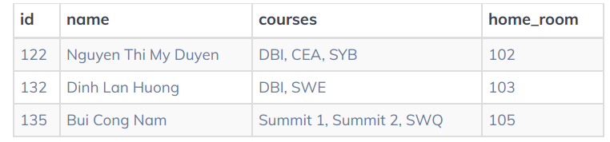

Nếu Duyên muốn học môn `SWE` thay vì môn `CEA`, cột `courses phải được cập nhật như sau:

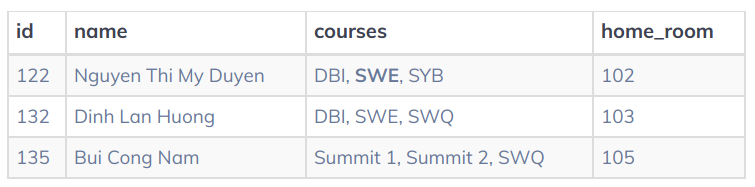

Tuy nhiên một nhân viên của trường có thể không nhận ra ranwgf việc thay đổi các khóa học của Duyên đã được thực hiên, dẫn đến khóa học `SWE` được thêm một lần nữa.

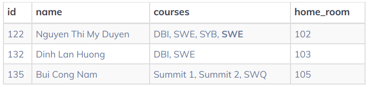

Như vậy cần có hành động đảm bảo dữ liệu trùng lặp không xuất hiện trong báo cáo tiến độ của học sinh hoặc các quy trình khác.

Ví dụ khác nếu Nam muốn bảo lưu môn học `Summit 2` giá trị dữ liệu (bao gôm phần còn lại của các khóa học của anh ta) phải được thay đổi. Trường hợp xấu nhất nếu xóa `Summit 2` thất bại thì toàn bộ dữ liệu khóa học của Nam sẽ mất.

Các vấn đề này có thể được khắc phục bằng cách đảm bảo rằng bảng `Student` thỏa mãn chuẩn đầu tiên - **1st Normal Form**. Yêu cầu của 1NF là:
```
Các giá trị bảng là nguyên tử (giá trị không thể chia nhỏ hơn được nữa)
```
Một số thay đổi cần thực hiện để đáp ứng **1NF**. Cột `name` bao gôm giá trị có thể được chia thành `first_name` và `last_name` của học sinh. Các giá trị của khóa học `courses` cần được tách ra. Bảng mới sẽ có nhiều cột hơn, nhiều hàng hơn, các bản ghi đã được nguyên tử hóa như sau.

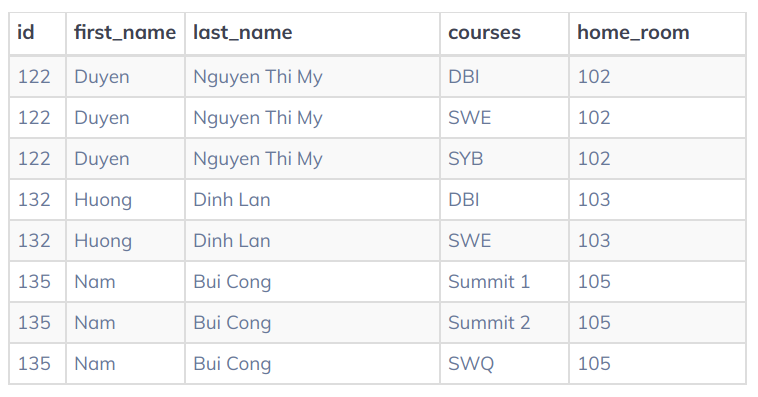

Các bản ghi đã rõ ràng hơn nhiều.

Thêm một ví dụ nữa
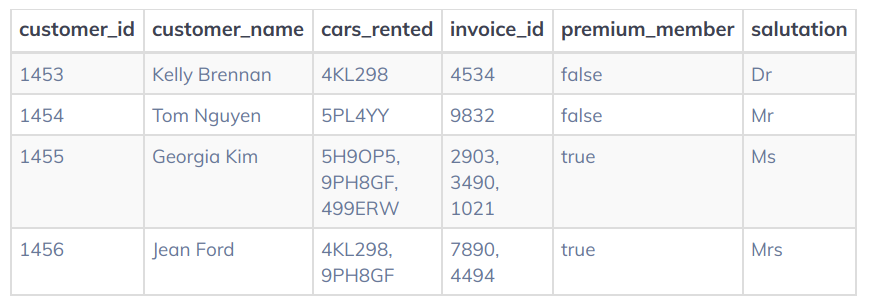

Bảng này không đạt chuẩn **1NF** do có nhiều giá trị trong cột `cars_rented` và `invoice_id`.

## Data Normalization
Cùng xem một ví dụ. Các quản trị viên của một trường muốn quản lý các sách giáo khoa được sử dụng trong mỗi khóa học của trường trong cơ sở dữ liệu. Một bảng `textbook` được đề xuất như sau:

```python
CREATE TABLE textbook (
    id SERIAL PRIMARY KEY
    name VARCHAR(100) NOT NULL, 
    publisher_name VARCHAR(100) NOT NULL, 
    publisher_site VARCHAR(50),
    quantity SMALLINT NOT NULL DEFAULT 0,
);
```
Bảng này có 5 cột đó là `id`, `title`, `publisher_name`, `publisher_site` và `quantity`. Dưới đây là một phần gồm 3 hàng trong bảng này.

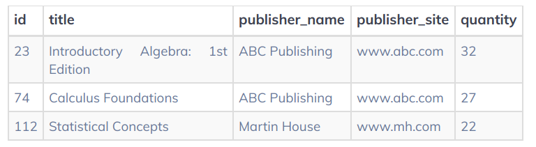

Tại sao một cấu trúc bảng như trên có vấn đề? 

Tưởng tượng rằng `ABC Publishing` quyết định cập nhật url trang web của họ. Điều này có nghĩa rằng chúng ta cần cập nhật nhiều bản ghi do cần cập nhật cột `publisher_site`. Trường hợp url của trang wed nhà xuất bản ABC không được cập nhật cho tất cả các hàng có thể dẫn đến **sự không nhất quán** trên các hàng như hình dưới đây.. 
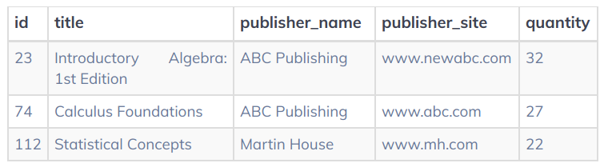

Việc thêm dữ liệu hay xóa sách giáo khoa khỏi bảng này cũng có khả năng gây ra sự dị thường về dữ liệu như trên.

**Dạng chuẩn 2**
Việc chuyển đổi bảng sang dạng chuẩn 2 (2NF) sẽ khắc phục được các vấn đề nêu trên. 

**Một cơ sở dữ liệu ở 2NF khi nó đạt được tiêu chuẩn 1NF và các cột không khóa chỉ phụ thuộc vào khóa chính của bảng**

Điều này có thể thực hiện như sau:
* Trước tiên di chuyển tất cả các dữ liệu của nhà xuất bản sang bảng riêng trong cơ sở dữ liệu. Tuy nhiên sự tách biệt giữa các nhà xuất bản và sách giáo khoa cũng đã loại bỏ kết nối giữa các đối tượng.
* Khôi phục kết nối này bằng cách tạo một KHÓA NGOẠI trong bảng `textbook` tham chiếu một bản ghi trong bảng `publisher`. Kết quả chúng ta có một thiết kế như sau:

```python
CREATE TABLE textbook (
    id SERIAL PRIMARY KEY,
    name VARCHAR(100) NOT NULL,
    quantity SMALLINT NOT NULL DEFAULT 0,
    publisher_id INTEGER REFERENCES publisher(id)
);
```

```python
CREATE TABLE publisher (
    id SERIAL PRIMARY KEY,
    name VARCHAR(100) NOT NULL,
    site VARCHAR(50)
);
```

Việc thỏa mãn **2NF** thường dẫn đến việc tạo ra các bảng mới nhưng nó giúp chúng ta **giảm sự trùng lặp** dữ liệu - một trong những mục tiêu của chúng ta trong việc chuẩn hóa.

Thêm một ví dụ nữa.

Các nhân viên quá cà phê đã nghe ngóng được tình hình đang diễn ra tại trường trung học để sắp xếp dữ liệu cho các hoạt động quan trọng của trường sắp đến. Đặc biệt họ muốn theo dõi các lựa chọn bữa ăn khác nhau có sẵn trong suốt năm học và họ đã tạo ra bảng `meal` như sau:
```python
CREATE TABLE meal (
    id INTEGER, --id duy nhất của món ăn
    title VARCHAR(50) NOT NULL, --tên của món ăn
    ingredinets VARCHAR(150), -- danh sách các nguyên liệu
    avg_student_rating NUMERIC, -- điểm xếp hạng trung bình từ sinh viên
    date_served DATE, -- ngày được phục vụ
    total_calories SMALLINT NOT NULL -- tổng số calo
);
```
Dựa vào kiến thức đã học hãy cải tiến một cơ sở dữ liệu tốt hơn.
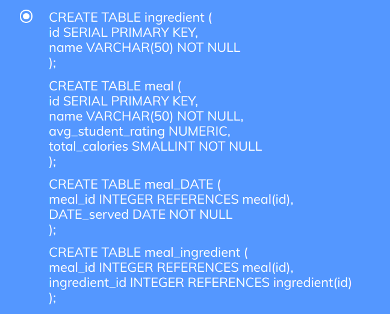

## Data Normalization 3NF
Để đáp ứng dạng chuẩn 3 (**3NF**) chúng ta phải:
* Đáp ứng các yêu cầu của 2NF
* Không có sự tồn tại của **phụ thuộc bắc cầu** trong bảng. Điều này có nghĩa rằng các cột không khóa trong bảng chỉ phụ thuộc vào khóa chính.

Các phụ thuộc bắc cầu (**transitive dependency**) là các mối quan hệ trong một bảng cơ sở dữ liệu có ba cột. Tưởng tượng một bảng có nhiều cột: X, Y và Z. Cột Y được xác định bởi cột X. Vì vậy nếu chúng ta biết giá trị của cột X, thì cột Y cũng được biết đến. Trong kịch bản này cấu trúc mối quan hệ tương tự tồn tại giữa cột Y và cột Z. Biết giá trị của cột Y sẽ biết giá trị của cột Z. Trong trường hợp này, phụ thuộc bắc cầu là giữa cột X và cột Z. Mặc dù cột X và cột Z không liên quan trực tiếp.

Giả sử chúng ta có một bảng lưu trữ dữ liệu về các phòng học theo môn học:
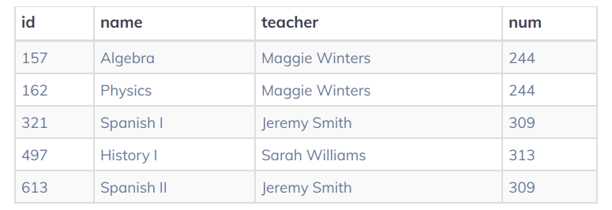

Trong trường hợp này giáo viên dạy trong cùng một lớp học suốt cả ngày. Nếu chúng ta biết tên của khóa học, chúng ta sẽ tự động biết tên của giáo viên. Biết tên giáo viên là tất cả những gì chúng ta cần biết để có được số phòng giáo viên. Do đó, biết tên khóa học là đủ để biết số phòng cho lớp. Mối quan hệ này tạo ra phụ thuộc bắc cầu. Có vấn đề gì với cấu trúc bảng như trên?

Thiết kế bảng này yêu cầu thay đổi nhiều hàng đẻ cập nhật số phòng giáo viên. Cấu trúc bảng theo cách này không cho phép thêm giáo viên mới vào cơ sở dữ liệu trừ khi một khóa học liên quan được gán cho giáo viên đó. Nếu tất cả các khóa học của giáo viên bị xóa khỏi bảng, chúng ta không còn thông tin về giáo viên (cụ thể là tên và số phòng của cô ấy).

Làm sao thay đổi cấu truc dữ liệu của để giảm bớt những vấn đề tiềm ẩn đó? Một thay đổi hữu ích là tạo ra một bảng dữ liệu dành riêng cho giáo viên. Chúng ta sẽ gán cho mỗi giáo viên một id duy nhất bằng cách sử dụng KHÓA CHÍNH của bảng và có thể liên kết số phòng với giáo viên ở một vị trí.

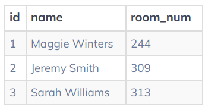

Điều này cho phép chúng ta đơn giản hóa cấu trúc của bảng `course`. Tiếp theo chúng ta sẽ xóa các cột `teacher`, `num` và thêm một KHÓA NGOẠI `teacher_id`. Khóa học được liên kết với tên giáo viên và số phóng thông qua KHÓA NGOẠI `teacher_id`.

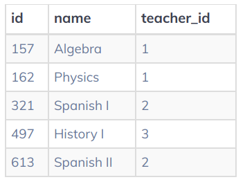


