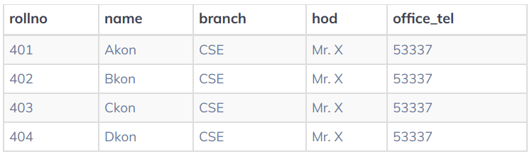

# Chuẩn hóa dữ liệu

## Mở đầu
Chuẩn hóa dữ liệu (data normalization) được thực hiện để đảm bảo dữ liệu khỏi sự bất thường và giữ nguyên tính toàn vẹn của dữ liệu.

Nếu dữ liệu không được chuẩn hóa đúng cách và sự tồn tại của dữ liệu thừa không những làm tăng bộ nhớ mà còn cản trở quá trình thao tác.



Nhận thấy dữ liệu có các trường (cột) ` branch, hod` và `office_tel` lặp lại đối với các sinh viên học cùng một chi nhánh trong đại học. Đây chính là dư thừa dữ liệu (**Data Redundancy**).

Nếu phải chèn dữ liệu của 100 sinh viên cùng ngành thì thông tin chi nhánh sẽ được lặp lại cho tất cả 100 sinh viên. Đó chính là chèn dị thường (**Insertion anomalies**).

Nếu bạn X rời đại học hoặc không còn là HOD của khoa khoa học máy tính. Trong trường hợp đó tất cả các hồ sơ sinh viên sẽ được cập nhật, nếu nhầm lẫn ta sẽ bỏ lỡ bất kỳ hồ sơ này. Điều này dẫn đến sự không thống nhất dữ liệu. Đây là cập nhật dị thường (**Updation anomaly**).

Trong bangr `Student`, hai thông tin khác nhay được lưu giữ cùng nhau. Thông tin sinh viên và thông tin chi nhánh. Do đó vào cuối năm học nếu hồ sơ sinh viên bị xóa bỏ ta cũng sẽ mất thông tin chi nhánh. Đây là xóa dị thường (Deletion Anomaly).

Chốt lại các lý do chính cần chuẩn hóa dữ liệu:
* Giảm sự trùng lặp về dữ liệu
* Đảm bảo tính nhất quán của dữ liệu
* Dữ liệu được sắp xếp sao cho các đối tượng dữ liệu ánh xạ tốt hơn tới các bản ghi trong bảng.

## 1st Normal Form (1NF)
Để bắt đầu quá trình chuẩn hóa cơ sở dữ liệu chúng ta sẽ bắt đầu bằng cách đi vào bước đầu tiên của quy trình - yêu cầu mỗi bảng phải ở dạng chuẩn đầu tiên - **1st Normal Form (1NF)**.

Một trường học muốn duy trì hồ sơ học sinh trong cơ sở dữ liệu. Một thiết kế đầu tiên của cơ sở dữ liệu này dẫn đến việc tạo ra một bangr `Student`. Một mẫu dữ liệu được hiển thị như sau:


Nếu Duyên muốn học môn `SWE` thay vì môn `CEA`, cột `courses phải được cập nhật như sau:


Tuy nhiên một nhân viên của trường có thể không nhận ra ranwgf việc thay đổi các khóa học của Duyên đã được thực hiên, dẫn đến khóa học `SWE` được thêm một lần nữa.


Như vậy cần có hành động đảm bảo dữ liệu trùng lặp không xuất hiện trong báo cáo tiến độ của học sinh hoặc các quy trình khác.

Ví dụ khác nếu Nam muốn bảo lưu môn học `Summit 2` giá trị dữ liệu (bao gôm phần còn lại của các khóa học của anh ta) phải được thay đổi. Trường hợp xấu nhất nếu xóa `Summit 2` thất bại thì toàn bộ dữ liệu khóa học của Nam sẽ mất.

Các vấn đề này có thể được khắc phục bằng cách đảm bảo rằng bảng `Student` thỏa mãn chuẩn đầu tiên - **1st Normal Form**. Yêu cầu của 1NF là:
```
Các giá trị bảng là nguyên tử (giá trị không thể chia nhỏ hơn được nữa)
```
Một số thay đổi cần thực hiện để đáp ứng **1NF**. Cột `name` bao gôm giá trị có thể được chia thành `first_name` và `last_name` của học sinh. Các giá trị của khóa học `courses` cần được tách ra. Bảng mới sẽ có nhiều cột hơn, nhiều hàng hơn, các bản ghi đã được nguyên tử hóa như sau.


Các bản ghi đã rõ ràng hơn nhiều.

Thêm một ví dụ nữa


Bảng này không đạt chuẩn **1NF** do có nhiều giá trị trong cột `cars_rented` và `invoice_id`.